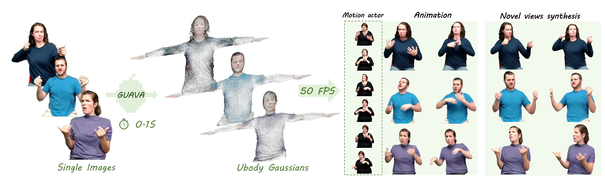
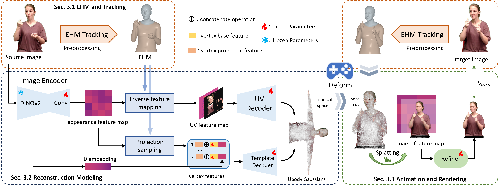

<p align="center">
  <h1 align="center">[ICCV 2025] GUAVA: Generalizable Upper Body 3D Gaussian Avatar</h1>
<p align="center">

<p align="center">
  <a href="https://github.com/EastbeanZhang">Dongbin Zhang</a><sup>1,2</sup>, 
  <a href="https://liuyunfei.net/">Yunfei Liu</a><sup>2†</sup>,
  <a href="https://scholar.google.com/citations?hl=en&user=Xf5_TfcAAAAJ">Lijian Lin</a><sup>2</sup>, 
  <a href="https://scholar.google.com/citations?hl=en&user=qhp9rIMAAAAJ">Ye Zhu</a><sup>2</sup>, 
  <a href="None">Yang Li</a><sup>1</sup>, 
  <a href="https://github.com/minghanqin">Minghan Qin</a><sup>1</sup>, 
  <a href="https://yu-li.github.io/">Yu Li</a><sup>2‡</sup>,
  <a href="https://www.sigs.tsinghua.edu.cn/whq_en/main.htm">Haoqian Wang</a><sup>1†</sup>
  <br>( <sup>1</sup>Tsinghua University, <sup>2</sup>International Digital Economy Academy )<br>
</p>

<div style="text-align: center;">

[](https://eastbeanzhang.github.io/GUAVA/)
[](https://arxiv.org/abs/2505.03351)
[](https://github.com/Pixel-Talk/EHM-Tracker/)
[](https://www.youtube.com/watch?v=ylyTO34l5d0)
[](https://www.bilibili.com/video/BV1k45AzaEpW)

</div>


## 🗓️ Roadmap
Here's our current progress and upcoming plans for the GUAVA:
* **Inference Code:** Released on August 10, 2025 ☑️
* **Tracking Code:** Released on October 08, 2025 ☑️
* **Training Code:** Released on October 08, 2025 ☑️

## 📌 Introduction
This repository contains the official author's implementation associated with the paper "GUAVA: Generalizable Upper Body 3D Gaussian Avatar".

With just a single image and a tracked pose, GUAVA can generate a 3D upper-body Gaussian avatar in sub-second time via feed-forward inference, enabling real-time expressive animation.

<p align="center">
  
</p>

<!-- |  |
| :----------------------------------------------------------: |
| Pipeline of GUAVA |    -->


## 🛠️ Setup

This guide outlines the steps to set up and run the project components, which have been tested on Ubuntu Linux 20.04.

#### Cloning the Repository
```shell
# Via SSH
git clone git@github.com:Pixel-Talk/GUAVA.git --recursive
or
# Via HTTPS 
git clone https://github.com/Pixel-Talk/GUAVA.git --recursive

cd GUAVA
```

#### Hardware Requirements
- GPU: CUDA-ready GPU with Compute Capability 7.0 or higher.
- VRAM: At least 6GB of VRAM for inference or 48GB to achieve paper-quality training results.

#### Software Requirements
- Python: Version 3.10
- CUDA SDK: Version 11 (specifically tested with 11.8) for PyTorch extensions.
- C++ Compiler: Must be compatible with your installed CUDA SDK.

### Environment Setup
Our default, provided install method is based on Conda package and environment management:
```shell
# Create and Activate Conda Environment:
conda create --name GUAVA python=3.10
conda activate GUAVA

# Install Core Dependencies:
pip install -r requirements.txt

# Install PyTorch3D:
pip install "git+https://github.com/facebookresearch/pytorch3d.git@v0.7.7"

# Install Submodule Dependencies:
cd submodules
pip install diff-gaussian-rasterization-32
pip install simple-knn
pip install fused-ssim
cd ..
```
## 📦 Model Preparation

#### Parametric Models:
- SMPLX: Download `SMPLX_NEUTRAL_2020.npz` from [SMPLX](https://smpl-x.is.tue.mpg.de/download.php) and place it in the `assets/SMPLX`.
- FLAME: Download the `generic_model.pkl` from [FLAME2020](https://flame.is.tue.mpg.de/download.php). Save this file to both `assets/FLAME/FLAME2020/generic_model.pkl` and `assets/SMPLX/flame_generic_model.pkl`.

#### For inference:
To run inference, you will need to acquire the following:

- Manual Download:
  - GUAVA Pretrained Model Weight:
Download the [pretrained weight](https://drive.google.com/file/d/19_p1FUoJTHfb9t_S2_DpNta4nrwSXabl/view?usp=sharing), unzip the file, and place it in the `assets/GUAVA`.

  - Example Tracked Videos:
Donwnload some [tracked example videos](https://drive.google.com/drive/folders/1nluFTweBznLAmz5Yx8obpOUGcZxlqpNF?usp=share_link) for inference. Unzip the downloaded files and place them in the `assets/example`.

- Command-line Download:
  ```shell
  bash assets/Docs/run_download.sh
  ```

## 🚀 Inference Scripts

Execute the following command to perform self-reenactment:
```shell
 python main/test.py \
 -d '0' \
 -m assets/GUAVA \
 -s outputs/example \
 --data_path assets/example/tracked_video/6gvP8f5WQyo__056
```

Execute this command to perform cross-reenactment, transferring the motion and expression from a target video to the person in a source image:
```shell
 python main/test.py \
 -d '0' \
 -m assets/GUAVA \
 -s outputs/example \
 --data_path assets/example/tracked_video/6gvP8f5WQyo__056 \
 --source_data_path assets/example/tracked_image/NTFbJBzjlts__047 \
 --skip_self_act \
 --render_cross_act
```

## 🎯 Tracking
To process your own videos, images, or to build a custom tracking training dataset, you will need to use our [EHM-Tracker](https://github.com/Pixel-Talk/EHM-Tracker).

Navigate into the EHM-Tracker directory and follow the instructions provided in its [README.md](EHM-Tracker/README.md) file for detailed guidance.


## 🚂 Training Scripts
You can use the EHM-Tracker to build your own dataset.

Once your dataset is prepared, run the following command to train your own GUAVA model.
```shell
python main/train.py -c train/ubody_512 -d '0,1'
```

## Helpers

Convert motion scripts (FLAME and SMPL-X). Make sure to change the paths internally in the `convert_motion.py` script 

``` shell
python convert_motion.py
```

Creating Ubody avatar

``` shell
python create_avatar.py --model_path assets/GUAVA --data_path /path/to/your/data/ --source_video_id video_id --output_avatar_path path/to/my_avatar.pt
```

Rendering your motion to the Ubody avatar. make sure both motion sets are 25/30 FPS.

``` shell
python render_motion.py --smplx_path path/to/smplx/motion/smplx.npz --flame_path path/to/flame/motion/flame.npy --output_path talking_video.mp4
```

If you want to resample motion use `resample_motion.py`. Change the file paths in the code first.

``` shell
python resample_motion.py
```

`


## 🖥️ Interface Demo
After setting up the environment, necessary files, and the EHM-Tracker, you can try our interactive demo by running:

```shell
python app.py
```


## 📖 BibTeX
If you find our work helpful, please ⭐ our repository and cite:
```bibtex
@article{GUAVA,
  title={GUAVA: Generalizable Upper Body 3D Gaussian Avatar},
  author={Zhang, Dongbin and Liu, Yunfei and Lin, Lijian and Zhu, Ye and Li, Yang and Qin, Minghan and Li, Yu and Wang, Haoqian},
  journal={arXiv preprint arXiv:2505.03351},
  year={2025}
}
```

## 🙏 Acknowledgement
We sincerely appreciate the contributions of the research community that made this work possible.  

Our implementation is built upon the PyTorch framework for **3D Gaussian Splatting** from [GraphDeco-Inria](https://github.com/graphdeco-inria/gaussian-splatting). We thank the authors for their open-source efforts and inspiring research.  

We also acknowledge the developers and maintainers of the following projects, which played a crucial role in our implementation:  

- **[diff-gaussian-rasterization](https://github.com/graphdeco-inria/diff-gaussian-rasterization)**: The differentiable Gaussian rasterization library, essential for rendering.
- **[FLAME](https://flame.is.tue.mpg.de/)**: A 3D head parametric model. 
- **[SMPLX](https://smpl-x.is.tue.mpg.de/)**: A 3D human parametric model. 

Finally, we thank our collaborators, colleagues, and the open-source community for their valuable discussions and continuous support.
